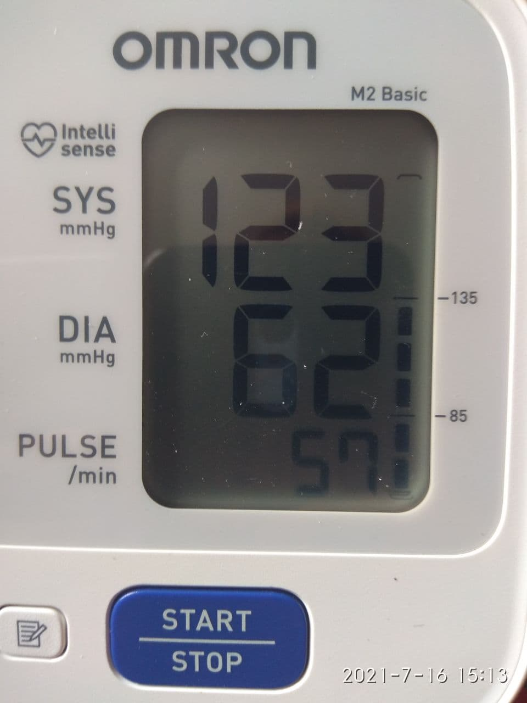
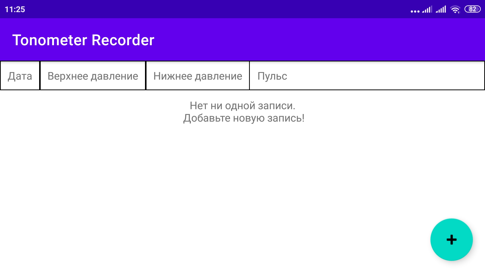
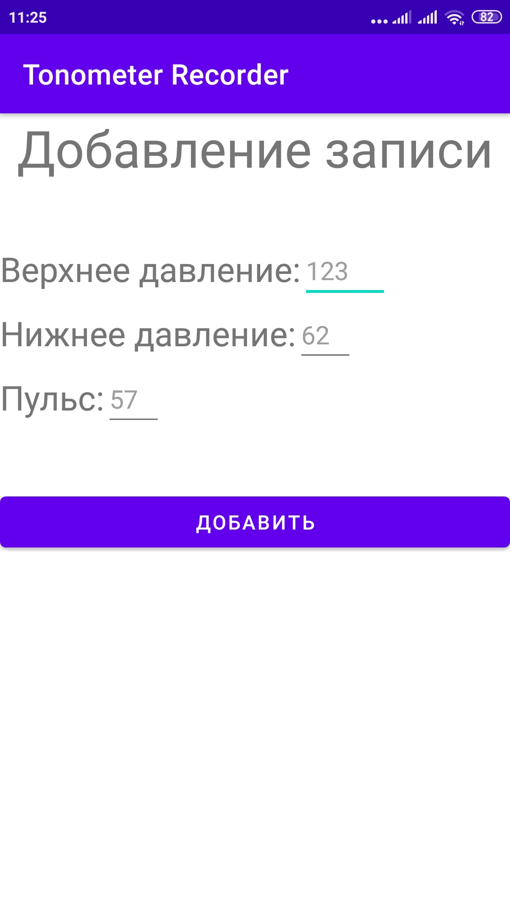
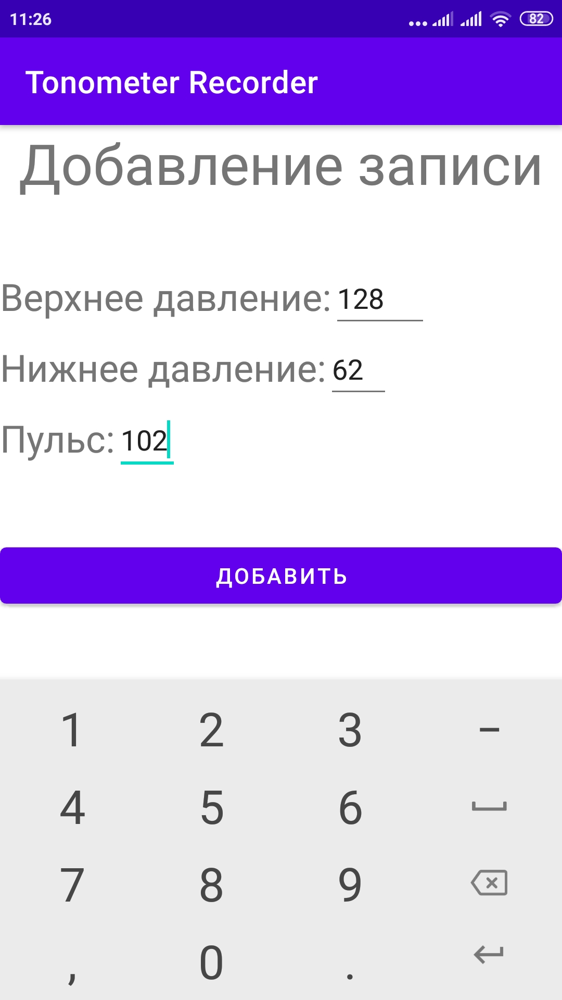
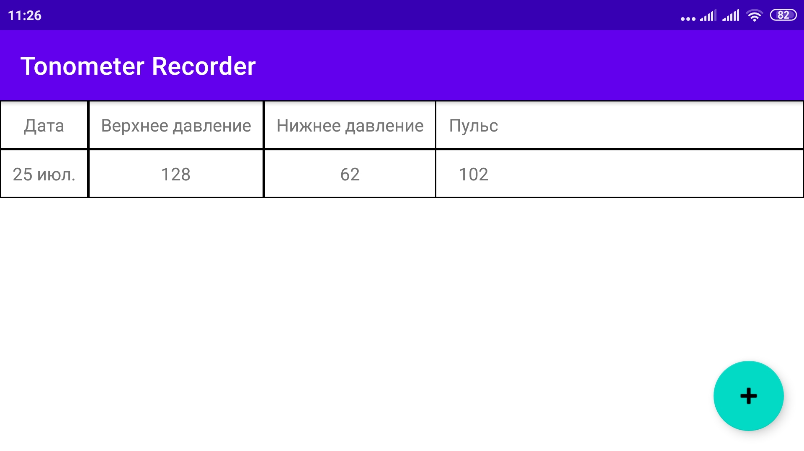

# Pet project: Tonometer Recorder

Приложение, которое позволяет вводить и сохранять результаты тонометра.

Люди, которые следят за своим здровьем измеряют давление каждый день.
Это приложение позволяет вводить ежедневные показания и хранить их на телефоне.

Тонометр - это прибор, который позволяет измерять верхнее, нижнее давление и пульс.

# Android version, minSdkVersion, libraries

Android version - 6.0

minSdkVersion - 23

Для сохранения данных в БД используется Андроид библиотека Rooom.

# Screenshots

# Download

Если у Вас нет желания собирать приложение в Андроид Студии, Вы можете [скачать собранный apk файл](https://github.com/user576g/TonometerRecorder/releases/download/0.0.0/app-release.apk)
